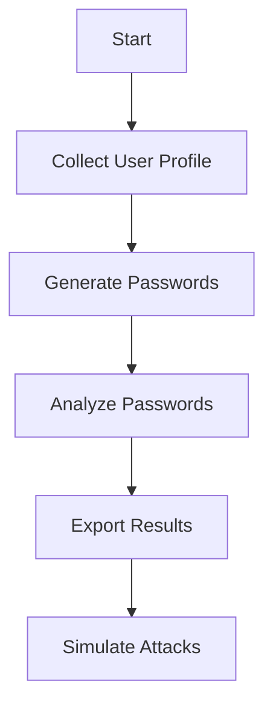

# DarkForge User Manual

## Table of Contents
1. [Introduction](#introduction)
2. [Installation](#installation)
3. [Quick Start](#quick-start)
4. [Command Reference](#command-reference)
5. [Features](#features)
6. [Examples](#examples)
7. [Troubleshooting](#troubleshooting)
8. [FAQ](#faq)

## Introduction

DarkForge is a powerful command-line toolkit for password analysis, generation, and attack simulation. It helps security professionals and researchers understand password patterns, generate targeted password lists, and simulate various password attacks.

### Core Features
- Password generation based on user profiles
- Comprehensive password analysis
- Attack simulation
- Database storage for results
- Export formats for popular password cracking tools

## Installation

### Prerequisites
- Python 3.8 or higher
- pip (Python package installer)

### Installation Steps

1. Clone the repository:
```bash
git clone https://github.com/yourusername/darkforge.git
cd darkforge
```

2. Install dependencies:
```bash
pip install -r requirements.txt
```

3. Verify installation:
```bash
python main.py --help
```

## Quick Start

### Basic Usage Flow



### Example Commands

1. Generate passwords:
```bash
python main.py generate --source cli --output passwords.txt
```

2. Analyze passwords:
```bash
python main.py analyze --password-file passwords.txt --output-dir analysis_results
```

3. Check a single password:
```bash
python main.py analyze check --password "YourPassword123"
```

4. Export for cracking tools:
```bash
python main.py attack export --password-file passwords.txt --format hashcat --hash-type sha256
```

## Command Reference

### Generate Command
```bash
python main.py generate [OPTIONS]
```

| Option | Description | Required | Default |
|--------|-------------|----------|---------|
| --source | Data source (cli/file) | No | cli |
| --file | JSON file path | Yes (if source=file) | None |
| --output | Output file path | No | passwords.txt |

### Analyze Command
```bash
python main.py analyze [OPTIONS] COMMAND [ARGS]
```

#### Subcommands:
1. `analyze`
   - Options:
     - --password-file: File containing passwords
     - --output-dir: Directory for results
     - --no-visuals: Disable visualization
     - --pattern-only: Pattern analysis only

2. `check`
   - Options:
     - --password: Password to analyze

### Attack Command
```bash
python main.py attack [OPTIONS] COMMAND [ARGS]
```

#### Subcommands:
1. `export`
   - Options:
     - --password-file: File containing passwords
     - --format: Export format (hashcat/john/plain)
     - --hash-type: Hash type for export

2. `simulate`
   - Options:
     - --password: Password to simulate
     - --attack-type: Type of attack (brute/dictionary)
     - --wordlist: Wordlist for dictionary attack

## Features

### Password Generation
- Based on user profile data
- Pattern-based generation
- Customizable output format
- Target: 2000-4000 passwords

### Password Analysis
- Pattern detection
- Strength assessment
- Entropy calculation
- Visualization generation

### Attack Simulation
- Brute force simulation
- Dictionary attack simulation
- Performance metrics
- Export formats for popular tools

### Database Storage
- SQLite database
- Stores:
  - User profiles
  - Analysis results
  - Attack simulations
  - Generation history

## Examples

### 1. Complete Password Analysis Workflow

```bash
# 1. Generate passwords
python main.py generate --source cli --output passwords.txt

# 2. Analyze generated passwords
python main.py analyze --password-file passwords.txt --output-dir analysis_results

# 3. Export for hashcat
python main.py attack export --password-file passwords.txt --format hashcat --hash-type sha256

# 4. Simulate brute force attack
python main.py attack simulate --password "TargetPassword123" --attack-type brute
```

### 2. Pattern Analysis Only

```bash
python main.py analyze --password-file passwords.txt --pattern-only
```

### 3. Export for Multiple Tools

```bash
# For hashcat
python main.py attack export --password-file passwords.txt --format hashcat --hash-type sha256

# For John the Ripper
python main.py attack export --password-file passwords.txt --format john --hash-type ntlm

# Plain wordlist
python main.py attack export --password-file passwords.txt --format plain
```

## Troubleshooting

### Common Issues

1. **Database Connection Error**
   - Solution: Check file permissions for darkforge.db
   - Ensure SQLite is installed

2. **Visualization Generation Failed**
   - Solution: Install matplotlib and seaborn
   - Check write permissions for output directory

3. **Pattern Detection Issues**
   - Solution: Update pattern definitions
   - Check input file encoding

### Error Messages

| Error Message | Cause | Solution |
|--------------|-------|----------|
| "Database connection failed" | Permission issues | Check file permissions |
| "Visualization failed" | Missing dependencies | Install required packages |
| "Pattern detection error" | Invalid input | Check input format |

## FAQ

### Q: What is the recommended password count?
A: DarkForge is designed to generate 2000-4000 passwords based on user profiles.

### Q: Which password cracking tools are supported?
A: DarkForge supports export formats for:
- Hashcat
- John the Ripper
- Plain wordlists

### Q: How is password strength calculated?
A: Password strength is calculated using:
- Entropy calculation
- Pattern detection
- Length analysis
- Character composition

### Q: Can I customize pattern detection?
A: Yes, patterns can be customized in the configuration file.

### Q: How is the database structured?
A: The SQLite database contains tables for:
- User profiles
- Password analysis
- Attack simulations
- Generation history

# 10 Improvements

## Machine Learning Integration
- Add ML models to predict password patterns
- Use NLP for analyzing common password structures
- Train models on real-world password datasets

## Advanced Pattern Detection
- Add keyboard walk patterns (e.g., qweasdzxc)
- Include language-specific patterns
- Add leetspeak transformations (e.g., password -> p@ssw0rd)
- Detect cultural and regional patterns

## Performance Optimization
- Implement multiprocessing for password generation
- Add batch processing for large password lists
- Optimize database queries
- Add caching mechanisms

## Enhanced Security Features
- Add password policy compliance checking
- Implement NIST password guidelines
- Add breach database integration
- Include password similarity scoring

## Reporting System
- Generate PDF reports
- Add executive summaries
- Include statistical analysis
- Generate compliance reports

## Extended Tool Integration
- Add support for more password crackers
- Implement custom rainbow table generation
- Add integration with HaveIBeenPwned API
- Support for custom hash formats

## Configuration System
- Add YAML configuration files
- Support for custom pattern rules
- Environment variable support
- Profile-based configurations

## Testing Framework
- Add unit tests
- Integration tests
- Performance benchmarks
- Security testing

## Logging System
- Add detailed logging
- Log rotation
- Audit trails
- Error tracking

## Documentation
- Add API documentation
- Include architecture diagrams
- Add contribution guidelines
- Create video tutorials


## Support

For issues and feature requests, please visit:
https://github.com/ShivendraCh/DarkForge/issues

## License

This project is licensed under the MIT License - see the LICENSE file for details. 

